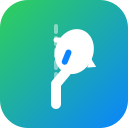
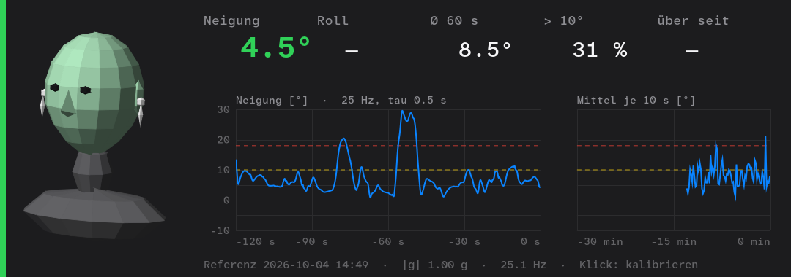

<div align="center">



# omarchy-haltung

**Sit up straight while you game: your AirPods Pro measure your head tilt, a panel on your second monitor shows it.**
For [Omarchy](https://omarchy.org) / Hyprland with the [omapods](https://github.com/thisisgm/omarchy-pods) librepods daemon. The UI is German.

[](https://omarchy.org)
[](#requirements)
[](LICENSE)
[](README.de.md)

</div>

---



## Why?

AirPods Pro have an accelerometer and gyroscope for Apple's spatial audio. On Linux nobody reads them,
but they stream fine over Bluetooth. Gravity tells you exactly how far your head is tipped forward,
with no drift and no camera. That is the classic "gaming hunch".

## What it shows

- 🧑 **3D head** that nods and tilts with yours (smooth while moving, nothing drawn while it rests)
- 📐 **Pitch** (forward / back) and **Roll** (sideways) against your calibrated upright pose
- 📈 **Plots:** the last 2 minutes at 25 Hz and the last 30 minutes as 10 s means, with the thresholds dashed
- 📊 **Stats:** mean of the last 60 s, share of the session above 10°, how long you have been above it
- 🔊 **Blips like a parking sensor:** one soft sound, slow at 6°, faster the further you lean, fastest from 18°, slower again as you sit up (`haltung --mute` toggles it)
- 🟢🟡🔴 **Status:** yellow above 10° pitch, **SITZ GERADE** in red after 15 s in a row

Only pitch counts as slouching: looking at the second monitor or tilting your head sideways does not.

## Install

```bash
git clone https://github.com/vsvito420/omarchy-haltung
cd omarchy-haltung
./install.sh
```

`install.sh` patches and rebuilds the librepods daemon once (see below), installs the panel to
`~/.local/share/haltung/` and starts it with the graphical session (`haltung.service`).
Remove it with `./uninstall.sh`.

### Requirements

- AirPods Pro 2 (or another model with head tracking), connected
- The [omapods](https://github.com/thisisgm/omarchy-pods) plugin with its librepods daemon
- `python-gobject` and `gtk4-layer-shell` (`omarchy pkg add python-gobject gtk4-layer-shell`)

## Calibrate

Click the panel (or bind `haltung --calibrate` to a key), then:

1. sit up straight, 3 s countdown
2. look straight ahead for 2 s
3. when it says so: look clearly **down**, then **up** (5 s)

The nod sweeps gravity through one plane. Its normal is your ear-to-ear axis, which is what splits
pitch from roll. Without a nod (less than 10°) you only get the total tilt.

## Settings

`~/.config/haltung/config.json`, then `systemctl --user restart haltung`:

| Key | Default | |
|---|---|---|
| `monitor` | `DP-1` | connector name of the monitor (`hyprctl monitors`) |
| `height` | `380` | panel height in px, reserved so windows do not cover it |
| `position` | `top` | `top` or `bottom` |
| `warn_deg` / `bad_deg` | `10` / `18` | pitch thresholds |
| `alert_after_s` | `15` | seconds above `warn_deg` before the red alert |
| `beep` | `true` | parking-sensor beeps (toggle with `haltung --mute`) |
| `beep_near_deg` | `4` | start blipping this many degrees below `warn_deg` (fastest at `bad_deg`) |
| `beep_volume` | `0.25` | 0 … 1 |

## How it works

**Code:** [`haltung.py`](haltung.py), [`head3d.py`](head3d.py), [`librepods-headtrack.patch`](librepods-headtrack.patch)

- AirPods speak AAP over Bluetooth L2CAP (PSM `0x1001`). Opcode `0x17` starts head tracking
  (packets from [LibrePods](https://github.com/kavishdevar/librepods)). They then send an 81-byte frame 25 times a second.
- The accelerometer sits at bytes 67/69/71 (int16, 1024 = 1 g). The panel smooths it (τ 0.5 s) and measures the
  angle against the calibrated vector.
- The pods stream **only to the first AAP connection**, which librepods holds. A second client gets nothing.
  So the patch adds a `headtrack` verb to librepods' control socket: whoever sends it gets every frame as a
  hex line until they hang up. The stream only runs while someone listens.
- The panel is a GTK4 layer-shell surface with an exclusive zone, so it is not a window, never takes focus and
  does not get covered.
- Built for gaming: `SCHED_IDLE` + nice 19, cairo software rendering (no GPU), readouts at 5 Hz, the
  3D head (~350 flat-shaded faces) at 30 fps only while it moves.

> [!WARNING]
> The patch changes the omapods plugin's files. After an update of the plugin, run `./install.sh` again.
> If the plugin update refuses because of local changes, run `git -C ~/.config/omarchy/plugins/io.github.thisisgm.omapods checkout daemon/`
> first, update, then reinstall.

> [!NOTE]
> Measured is the tilt of your head. Sliding forward in the chair with your head level is not detected.

`tools/probe.py` is the raw protocol probe used to find the frame layout (needs librepods stopped).

The patch is GPL-3.0 like librepods. Everything else is MIT.
